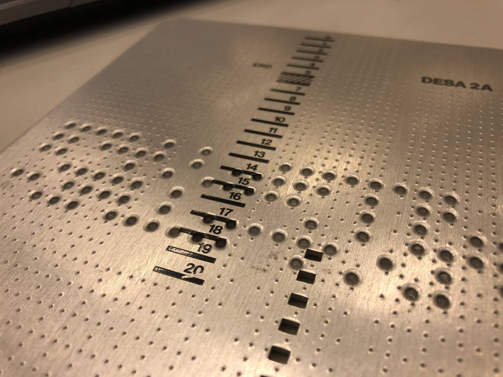

# GE-120 Test Rig

This repository contains the software used by the interactive museum of computer
archeology (MIAI) to reproduce the test rig for the CPU components of a 
General Electric GE-120.

## History of the computer

At the beginning of 1960s, General Electric was expanding its Research and
Development by acquiring companies in both US and Europe.

In 1964, GE took control of the French company Bull, at the
time a leading European manufacturer of machines for information technology.
In the same year Olivetti sold its electronics division to GE, but the local
division kept developing "Serie 100", a successful line of products based on 
"ELEA 9003", the first electronic computer based on transistors, originally designed and
produced by Olivetti in 1959.

The first model of the series, the GE-115 is in fact just a rebranding of the Olivetti
ELEA 4-115, which was completed and ready just before the acquisition,
and began production in 1965.

In 1967, the GE-115 was used by musician Pietro Grossi for a groundbreaking experiment
with computer generated music, the ["Pietro Grossi computer concerto on GE-115"](https://www.youtube.com/watch?v=CXosSsSekaU).

In 1970 Honeywell acquired GE's computer buisiness, forming Honeywell 
Information Systems, which also included the Italian R&D department working on the "Serie 100".
The "Serie 100" was rebranded intto "Honeywell Series 100", and the four models
in the product line were sold with the new names of "G-115", "G-130", "G-105" and "G-120".

According to [this datasheet from 1974](http://bitsavers.informatik.uni-stuttgart.de/pdf/honeywell/datapro/70c-480-16_7205_honeywell_series_100.pdf),  the flagship product 
of the series was the G-130, added to the production line
in April 1968. It offered approx. 3x the speed of execution of the G-115 and an
extended instruction set.

The document also mentions an "economy model" G-105, and finally the G-120, which is
a scaled-down version of the expensive G-130, with the same new instruction set and index registry
architecture, though at half the speed of the G-130, allowing for full arithmetic 
operations that were not possible on the G-115 and G-105. It was introduced in 1969 
as "GE-120" as affordable upgrade for GE-115 users.

The GE-120 machine that has been donated to the Museum was originally installed at the airport of
Zurich (CH), where it had been used for several years until it was dismissed in 1984.
An employee of the airport working as computer technician was allowed to keep the computer,
and since that day he had been keeping it until he kindly donated it to our Museum.

With several components the GE-120, including console, processing, memory, tape,
disk and printer units, weighted over 2000Kg, and required a huge amount of effort
and resources to move it from Switzerland to his new home at MIAI, in the south 
of Italy. This operation could not have been possible without the [donations](link?) 
collected through a successful social funding campaign.

## Our Goal

As an interactive museum, our final goal is of course to turn on the GE-120 and
make it operate again, crunching numbers as it used to, back in its best days.
This will of course require a lot of studying, testing and hopefully not too many
repair interventions. Restoring a 50+ years old computer is somewhat challenging,
but luckily the digital electronic and the logic design of the series-100 is not
too far from what we use today, as opposed to vacuum-tube architectures from the
same era.

## Testing CPU circuits

One interesting feature of the GE-120 is the possibility to run diagnostics on the
hundreds of circuit boards composing the main CPU unit. The original test rig is
simple and does not require to power on all the "wings". The tool is installed in
the cabinet containing the main console, and offer a simple user interface panel,
with buttons, switches, and pre-LED visual indicators made with light bulbs.

The single circuit board under test must be connected to the port on the right hand
side of this panel. Each board has an identification number that can be used to
derive the original scheme by looking at the 'atlas' manual, describing all the
components in the main CPU wing.

On the left-hand side, there is a thin drive used to load the 'software' logic for 
the test setup, which comes in the form of punched metal plates, stored in elegant
plastic boxes. Each circuit board can be tested with the tool using the corresponding
punched metal plate, containing a full logic-test coverage for all the logic components
on the board itself.

### The original electromechanic test procedure

As mentioned earlier, most of the original manuals and documentation of the GE-120
have been kept in a good conditions and arrived safe and sound at the museum together
with the hardware. Documentation in our possession is in three languages, mostly in Italian
but with some parts in English and some notes in German, possibly taken during the
maintenance while the system was running in Zurich. Thanks to the detailed description
in the manuals, we were able to "run" the test with the original equipment.

The bus inside the main CPU wing consists of 34 wires, divided into two 17-pin ports,
namely "U31" and "U32". The eight and the last pin in each port carry a 5V Vcc and 
GND signals, respectivlely. The remaining 30 wires are used to carry input or output
signals, depending on the board layout. The labels "I" and "U" on the main test console
interface switches indicate "Ingresso" and "Uscita", Italian for "Input and "Output" respectively,
and are used to set up the direction of each signal for the circuit that we want
to test. Signal directions for each of the 30 lines must be set manually at the 
beginning of the test.

Our metal plates with the test description are read top to bottom, left to right.
Ridges punched in a specific position indicate a binary value "1" corresponding 
to that position.

The first row in each metal plate contains the description of the circuit under test.
"1" bits represent inputs, while "0" bits indicate outputs.

The metal plate is inserted all the way into its drive for the test to begin. The
switch on the top right corner is set to "O". When the 'Start' button is pressed,
the test console will turn on all the lamps corresponding to "1" in the first row
of the plate, showing which lines must be configured as input "I", using the three
rows of switches at the bottom.

At this point, the test is ready to run. The main switch on the top right must be
set to the "S" position. Pressing the black button on the top left moves the metal
plate up by one position, so the next row can be parsed.

Each row except from the first one contain one test case. For all signals
initially configured as output (switch in "U" position), the test rig will enforce
a logic "1" by setting the voltage to 5V, or a logic "0" by connecting the pin to
GND. Viceversa, for signals configured as input, the corresponding position in the
test row on the plate indicates the expected value for a successful test, so the
test rig will read the voltage from the circuit under test at the corresponding
pin, and indicate a fault when the expected value don't match.

One single test row can perform tests on one or more components on the board at a
time.

By pressing "Start" when a test row is selected on the plate, the test is activated.
As a result, if all the light bulbs in the diagnostic row on top are off, it means
that the test on the selected row is successful. When a fault is detected on an input
line, the test turns on the light bulb corresponding to the input line where
the signal read did not match the expected configuration. Looking at the bulbs, with
the help of the manual, it is possible to detect and identify the defective component
to replace.

The black button on the top left corner can be pushed again to jump up to the next
test case, and the procedure must be repeated until all the tests have been executed
and there is no more data to read from the metal plate.

### A modern-day approach

By playing around with the electromechanic testbed, we figured out that we could
reproduce a similar tool with modern technology, mainly for two reasons:

1. **The original tool has a lot of moving parts and it is extremely delicate to handle** - while restoring
the test console is part of our final goal, we don't necessarily want to rely on
mechanical parts that are subject to consumption and may not be fit to test all the
circuit boards, even multiple time, without requiring a great deal of maintenance itself.

2. **Automating the configuration to speed up tests** - The original test procedure requires a lot of
time to manually setup the direction of the I/O ports, and the procedure is prone
to human errors which further slow down the test execution. Modern embedded systems
can set up the direction of a general-purpose I/O port via software when parsing the
setup line at the beginning of the procedure description. Moreover, changing the type
of the device under test is easy and does not require changing metal plates and
reconfigure directions.

### The new testbed

One of the boxes with spare parts contained an "extension" board that was presumably used
to connect circuit boards to the back-plane while the panel was open, so it would "stick out"
and allow for debugging and live diagnostics on the signals. We connected two of these boards to
two Raspberry-pi 3, to provide a 5V power source for the bus, and a total of 30 GPIO signals
(15 for each bus) to drive the logic of the circuit under test on the other side of the connector.

The two Raspberry pi are connected to the same network, with hostnames "video3"
and "video4" for the obvious reason that they have been reused by borrowing the
hardware from another project in our lab. 
The test has been set up (hardware, software, data entry) by multiple hands&brains
working together across a short amount of time, so the purpose was mostly 'getting
things to work fast' rather than writing readable code. We promise it will improve.

All the software is installed on one of the two raspberry pi. The python script 
`ge-test.py` accept as only argument one of the files with the `.conf` extension.

`.conf` files are the equivalent of the metal plates in the electromechanic test,
which means that running the `ge-test.py` script once will perform all the tests
in the procedure associated to the circuit under test.

When `ge-test.py` starts, it copies all the bash scripts used to set, clear, read
and manage GPIOs to the secondary test node, then parses the test procedure, set
the direction of the GPIOs on both sides (locally and via SSH to the secondary node)
and finally set the output values and read the input signals for each line, reporting
about the status of the test at the end.

### Drawbacks, work-in-progress, known issues

- **Data entry** - We know, trust us. Copying the metal plates manually takes a
lot of time and gets boring after a while. We are already working on a OCR tool
that can do this for us. It's experimental and currently has some false "0"s.
We'll publish when it's fixed.

- **Direct GPIO-to-logic connections** ensure that we can drive the logic of the circuits
under test in the least invasive way. A limited current with a low voltage is sufficient
to test a large number of boards, which are mainly made of IC with TTL logic that
can work at 3v3 with a few mA. Our raspberry-pi GPIO in input mode are 5V tolerant and reading
the input values is not an issue.
On the other hand, we found out that some of the circuits contain blocks requiring more
voltage/power on the output signals, so we are currently studying the possibility of inserting
a bidirectional buffer on the 30 pins, with some sort of level shifters.

### Fault detected?

- So far we have changed one (1) faulty resistor.

